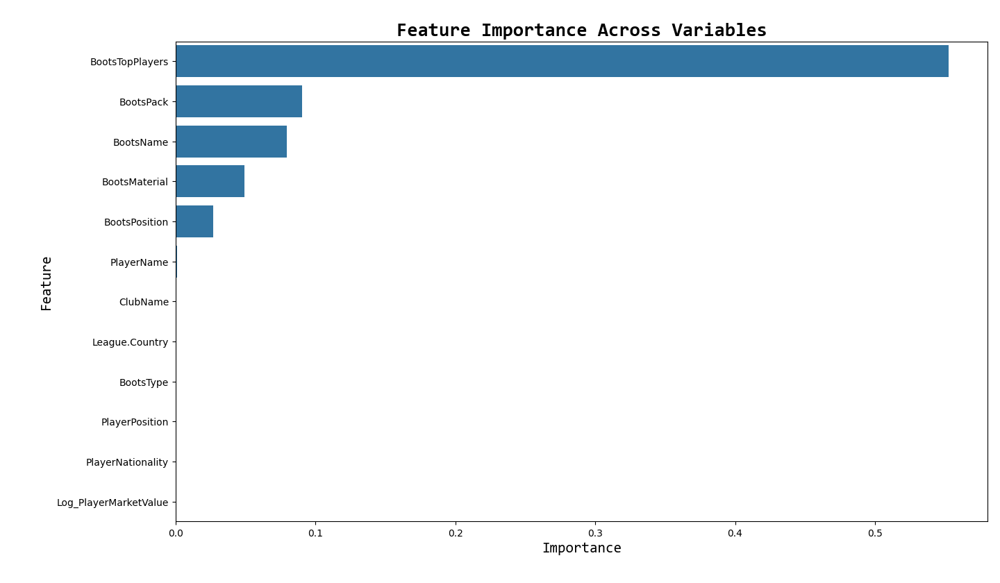

# Boot Brand Preference
Through machine learning modeling, this project investigates Soccer boot player preferences to predict to understand and predict soccer players' preferred boot brands and identify the key factors influencing their choices.

## Data:
[Soccer Boots](https://www.kaggle.com/datasets/muhammedzidan/football-boots-database) gathered from Kaggle.

## Models:
- Decision Trees
- Random Forest
- Gradient Boosting
- Ada Boosting
- Neural Networks

## Key Insights:
- **Inlfuential Factors:** The BootsTopPlayer feature was identified as the most significant factor influencing brand choice, suggesting players are highly influenced by the boots worn by top athletes.
- **Other Influential Factors:** BootsPosition and BootsMaterial were also key, indicating functional needs.

  

## Key Technologies:
**Language:** Python

**Libraries:**
- imblearn (Class Balancing)
- sklearn (Modeling and Evaluating)
- seaborn (Data Visualizations)
- matplotlib (Data Visualizations)

## Full Project Write-up:
For a detailed narrative, comprehensive methodology, and deeper insights into this project, please read the full write-up on [LinkedIn](https://www.linkedin.com/in/gaelmotahernandez/details/projects/1731117948171/single-media-viewer/?profileId=ACoAAD0sr1oBRU-g7rHenPy0sFhxgU6vSvExSdU).

---
